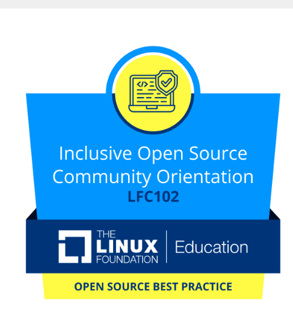

<div align="center">
  
</div>

<div align="center">
  <i>This is my second profile where I just experiment 🧪</i>
</div>

<div align="center">
  
</div>

<div align="center">
  <a href="https://training.linuxfoundation.org/training/inclusive-open-source-community-orientation-lfc102/" target="_blank" rel="noopener noreferrer">
    
  </a>
  <br />
  <a href="https://training.linuxfoundation.org/training/inclusive-open-source-community-orientation-lfc102/" target="_blank" rel="noopener noreferrer">
    
  </a>
</div>

---

### 👨‍💻 About Me

```rust
struct Developer {
    name: "Pragati",
    interests: ["Crypto", "Blockchain", "Web3"],
    languages: ["Rust", "Solidity", "JavaScript"],
    focus: "Building decentralized applications",
    status: "Always learning 🚀"
}
```

- 🔐 Passionate about **cryptocurrency** and **blockchain technology**
- 🦀 Building secure and efficient systems with **Rust**
- 📜 Writing smart contracts in **Solidity**
- 🌐 Creating web applications with **JavaScript**
- 💡 Exploring the decentralized future of the internet
- ✅ Completed **[LFC102 — Inclusive Open Source Community Orientation](https://training.linuxfoundation.org/training/inclusive-open-source-community-orientation-lfc102/)** (The Linux Foundation)

---

### 🏅 Certifications

<div align="center">
  <a href="https://training.linuxfoundation.org/training/inclusive-open-source-community-orientation-lfc102/" target="_blank" rel="noopener noreferrer">
    
  </a>
  <a href="https://training.linuxfoundation.org/training/inclusive-open-source-community-orientation-lfc102/" target="_blank" rel="noopener noreferrer">
    
  </a>
</div>

<details>
  <summary>View official certificate badge</summary>
  <br />
  <a href="https://training.linuxfoundation.org/training/inclusive-open-source-community-orientation-lfc102/" target="_blank" rel="noopener noreferrer">
    
  </a>
</details>

---

### 🛠️ Tech Stack

<div align="center">
  
  
  
  
  
  
  
  
  
  
  
  
  
  
  
</div>

<div align="center">
  
  
  
  
  
  
  
</div>

---

---

---

### 💼 What I'm Working On

- 🔐 Smart contract development and security auditing
- 🦀 High-performance blockchain infrastructure in Rust
- 🌐 Web3 dApps and DeFi protocols
- 📚 Learning advanced cryptographic concepts

---

### 📫 Connect With Me

<div align="center">
  <a href="https://x.com/pragativ005" target="_blank">
    
  </a>
  <a href="https://github.com/Pragati5-DEBUG" target="_blank">
    
  </a>
</div>

---

<div align="center">
  
</div>

<div align="center">
  
</div>
